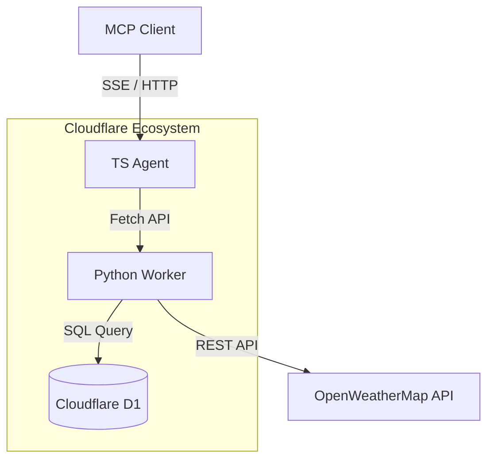

# MCP Weather Outfit

[](https://www.typescriptlang.org/)
[](https://www.python.org/)
[](https://workers.cloudflare.com/)
[](https://modelcontextprotocol.io/)

「 MCP Weather Outfit 」是一款基於 Cloudflare Workers 與 D1 構建的 MCP 伺服器，提供即時天氣查詢與穿搭建議功能（包含 Tools 、 Resources 以及 Prompts ）。

本專案的目標是展示如何使用 Cloudflare 的 Serverless 生態系統建立穩定且高效的 Model Context Protocol (MCP) 伺服器，提供完整的整合方案給予開發者參考。

## MCP Tools & Resources

本 MCP 伺服器提供以下核心功能供 LLM 或客戶端呼叫使用：

### Tools
- **`search_city_coordinates`**：查詢城市經緯度。
  - **Use Case**: 當使用者詢問特定城市天氣（例如「東京的天氣」），LLM 可使用此 Tool 將城市轉為英文 (`Tokyo`) 及國家代碼 (`JP`) 進行查詢，取得精確的 `lat` 與 `lon`。
- **`get_weather`**：依經緯度取得該地即時天氣。
  - **Use Case**: 取得經緯度後，LLM 呼叫此 Tool 以獲取包含溫度、體感、濕度、風速等完整的即時天氣資訊。

### Resources
- **`outfit_guidelines`** (URI: `res://outfit_guidelines`)：靜態穿搭指南。
  - **Use Case**: 提供不同氣溫區間的穿搭建議標準，讓 LLM 在回覆天氣資訊時，能結合此指南給予專業的穿搭建議。

### Prompts
- **`weather_outfit_advisor`**：天氣穿搭顧問 Prompt。
  - **Use Case**: 預先設定好的系統提示詞，引導 LLM 依照「辨識轉換城市 -> 查詢座標 -> 取得天氣 -> 讀取指南並給予建議」的標準流程進行回覆。

## Tech stack

- **Architecture**: Model Context Protocol (MCP)
- **Backend**: Cloudflare Workers (TypeScript / Python)
- **Database**: Cloudflare D1
- **Environment Management**: Node.js (npm) , [uv](https://docs.astral.sh/uv/)

## Require

建構此應用程式您可能需要以下工具：

- Node.js (含 npm )
- uv ( Python 套件管理器)
- Cloudflare 帳號
- [OpenWeatherMap API Key](https://openweathermap.org/api)

## Modules

採用模組化策略，本應用程式具有以下模組：

| Name | Responsibilities | Key details |
|:----:|:----:|:-----------------:|
| `workers/ts-agent` | TypeScript 實作的 MCP 伺服器，處理 SSE 連線，並提供 Tools 、 Resources 、 Prompts 介面供客戶端呼叫。 | `npm install`<br>`npm run dev` |
| `workers/python` | Python 實作的內部天氣與座標 API ，負責查詢 D1 資料庫、呼叫 OpenWeatherMap API ，並處理錯誤與限流。 | `uv run pywrangler dev` |
| `scripts` | 提供輔助工具腳本，例如將 `city.list.json` 轉換並匯入 D1 資料庫的 Python 腳本。 | `import_cities_to_d1.py` |

## Architecture

本專案將系統分為負責 MCP 協定的 TS Agent ，以及負責商業邏輯與資料存取的 Python Worker 。



## Build D1 Database

執行應用程式前，需要先完成 D1 資料庫設定與匯入：

1. **建立 D1 資料庫**：執行 `npx wrangler d1 create mcp-weather-db` 。將輸出的 `database_id` 填入根目錄的 `wrangler.toml` 。
2. **建立資料表**：執行 `npx wrangler d1 execute mcp-weather-db --remote --file=./schema.sql` 。
3. **匯入城市資料**：執行 `uv run python scripts/import_cities_to_d1.py` 產生分塊 SQL 腳本。接著透過迴圈執行： `for f in d1_chunks/insert_*.sql; do npx wrangler d1 execute mcp-weather-db --remote --file="$f"; done` 。

## Build Local Environment

若要在本機執行而不依賴遠端 D1 ，可匯入本地 D1 ：

1. **匯入本地 D1** ：執行 `npx wrangler d1 execute mcp-weather-db --local --file=./schema.sql` 與對應的分塊匯入。
2. **本機環境變數**：在根目錄新增 `.dev.vars` 並填入 `OPEN_WEATHER_KEY=你的金鑰` 。在 `workers/ts-agent/` 底下新增 `.dev.vars` 並填入 `PYTHON_WORKER_URL=http://localhost:8788` 。

## Build Testing

### Unit tests (Python Worker)

Python Worker 的單元測試採用 pytest，使用 Fake 依賴注入，無需 D1 或 OpenWeatherMap API 即可執行：

```bash
uv sync --extra dev
uv run pytest
```

## Deployment Python Worker

需先登入 Cloudflare ： `npx wrangler login` 。專案內的 `wrangler.toml` 已設定相關配置，可直接部署 Python Worker 。
在專案根目錄執行以下指令：

```bash
# 設定 OpenWeatherMap API Key
npx wrangler secret put OPEN_WEATHER_KEY

# 部署
npx wrangler deploy
```

部署後請記錄產生的 URL （例如 `https://mcp-weather-api.<你的帳號>.workers.dev` ）。

## Deployment TS Agent

在 `workers/ts-agent` 目錄下執行 TS Agent 的部署：

```bash
# 進入目錄
cd workers/ts-agent

# 設定 Python Worker 的對外 URL
npx wrangler secret put PYTHON_WORKER_URL

# 部署
npm run deploy
```

完成後， MCP 端點即為 `https://mcp-ts-agent.<你的帳號>.workers.dev/mcp` 。您可以在 Cursor 或 Cloudflare Agents 中設定此遠端端點進行整合。

## Access Control

本專案的 TS MCP 伺服器已實作 Cloudflare Access (SSO / OIDC) 保護，確保只有經過驗證的使用者能存取 MCP 端點。

設定步驟包含建立 Zero Trust 組織、配置 Access for SaaS 應用、建立 KV Namespace ( `OAUTH_KV` )，以及在 Worker 中設定對應的 Secrets (如 `ACCESS_CLIENT_ID` , `COOKIE_ENCRYPTION_KEY` 等)。存取時若未帶有有效 Cookie ，系統將回傳 401 Unauthorized 。

## License

本專案採用的授權條款請參考 [LICENSE](LICENSE) 檔案。